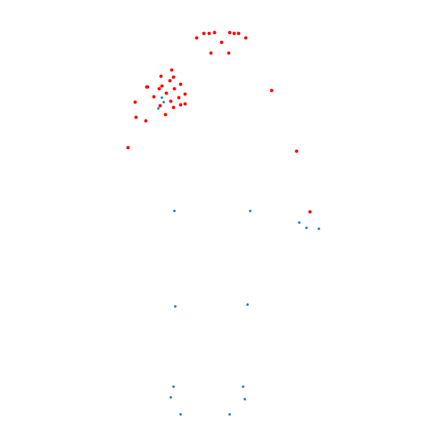
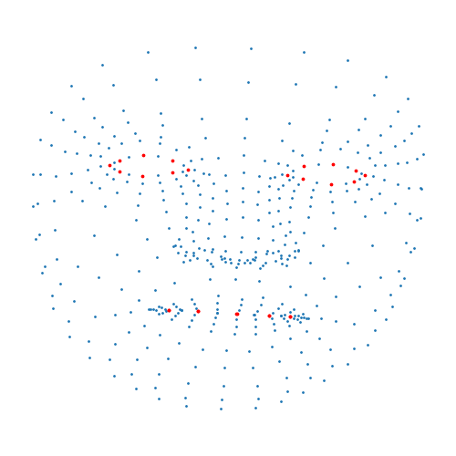

# 26th place solution
## [Google - Isolated Sign Language Recognition](www.kaggle.com/competitions/asl-signs)

### Summary
The most important part of the solution is the data utilization. Major improvements were from keypoints choice and 
mixup. External data does not help because it is from a very different distribution. Given data amount does not benefit 
larger models so ensembles of small models is the way to utilize given constraints to the fullest.

Most augmentations are not helpful, because they prevent model from learning the true data distribution. So only used 
mirroring and mixup (0.5).

### Inputs to the model
All models are trained to support sequences of up to 512 frames.
#### Preprocessing
- Only 2d coordinates are used as 3rd dimension leads to unstable training. 
- To normalize inputs all keypoints are shifted so that head is located at the origin. 
- Scaling did not provide any benefit so not used. 
- All nans are replaced with 0 after normalization.

#### Chosen keypoints
- All (21) hand keypoints
- 26 face keypoints
- 17 pose keypoints

  
   

### Architecture
[LLaMa](https://github.com/facebookresearch/llama)-inspired architecture. Most notable improvement comes from much 
better normalization [RMSNorm](https://arxiv.org/abs/1910.07467).

For all models head dimensions are set to 64

- 
    Single model (Private/Public LB: 0.8543689/0.7702471)
    
    6 heads 5 layers 9.2M parameters
- 
    Ensemble of 3 models (Private/Public LB: 0.8584568/0.7725324)
    
    2 heads 6 layers 1.7M parameters per model

Larger models could be fit into file size limit, but it would time out during submission.

### Augmentations
- The most important is [mixup](https://arxiv.org/abs/1710.09412). Significantly improves accuracy and allows for a much 
longer train before overfitting. Using with alpha=0.5.
- Mirroring, does not show much benefit on CV but can't hurt to use.

#### Augmentations that did not work:
- Interpolation over time. Tried using linear and spline interpolation to change the speed of the video and sample at 
    sub-frame coordinates.
- Shifting keypoints. Tried shifting keypoints in groups and individually by a small amounts.
- Rotating keypoints. Tried rotating keypoints around the head.
- Scaling keypoints. Tried scaling keypoint distance to the head.
- Mixup of 3+ datapoints. Did not have time to tune the alpha but from the start it did not show any benefit. 
So stayed with default 2 datapoints mixing.
- Rotating and scaling datapoints that are to be mixed up so that it would only mix relative pose and not absolute position.

### Training
- [Lion](https://arxiv.org/abs/2302.06675) optimizer is used. Faster convergence and better result (+1%) at the end.
- LR is 1e-4 with cosine decay to 1e-5 at the end of training.
- Batch size 128
- Dropout 0.1
- Exponential moving average of weights is used to improve stability of training. Gives 2-4% accuracy boost on CV.

#### Did not work:
- Training model of the data (i.e. trying to predict the next keypoint locations). Tried using different frequency of 
training the next token predictor and the best frequency turned out to be 0. 
- Label smoothing. Slower convergence and worse final result on CV.
